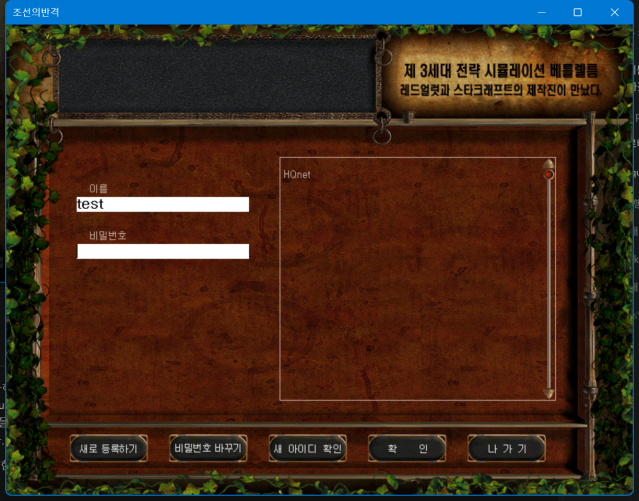
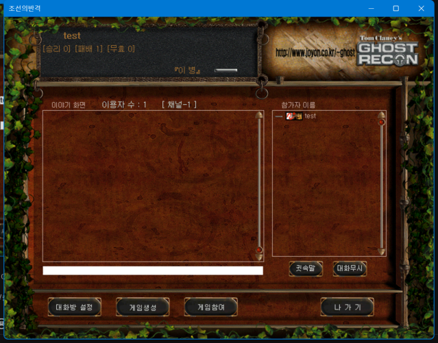
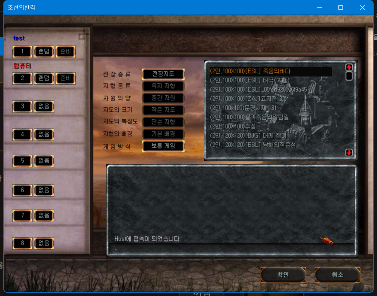
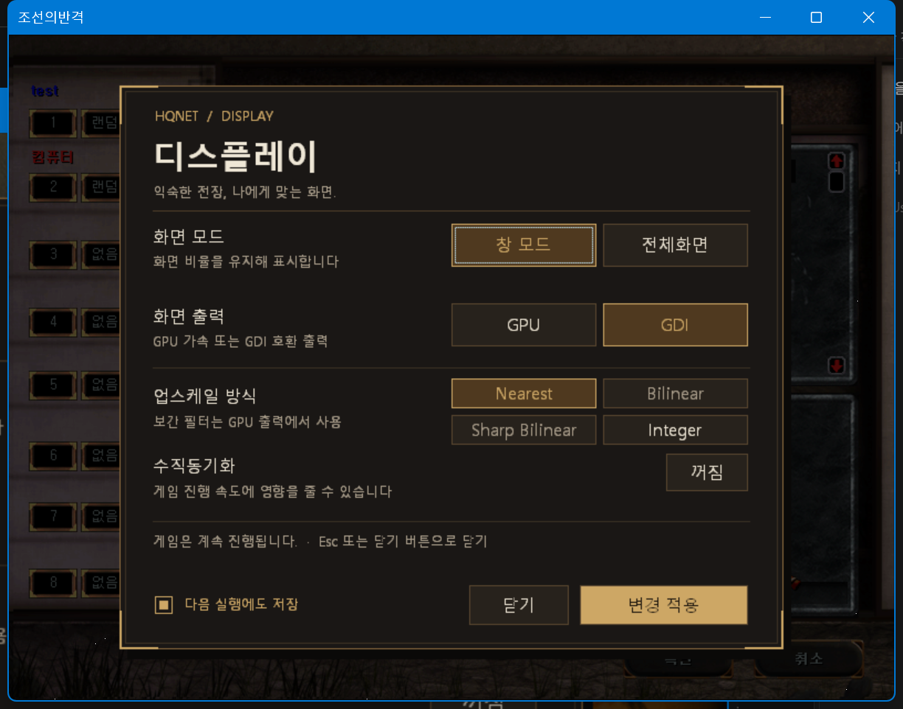

# HQCDD — 조선의반격 화면 개선 도구

설치·개발·성능 측정·과거 분석 자료는 [문서 안내](docs/index.md)에서 찾을 수 있습니다.

조선의반격을 창 모드와 전체화면으로 즐기고, 게임 안에서 화면 확대 방식을 바꿀 수 있습니다.
HQNET 로그인·채팅 입력칸이 사라지거나 깜빡이는 문제도 개선합니다.

**현재는 시험 배포 단계입니다.** Windows 11에서 동작한다는 사용자 확인이 있으며, 운영체제별 수동 검증은 1.0 이후에 진행합니다. Windows 10은 미검증입니다.
[변경 이력](CHANGELOG.md) · [배포 페이지](https://github.com/Jeongyong-park/syw2-ddraw/releases) · [문제 신고](https://github.com/Jeongyong-park/syw2-ddraw/issues)

## 무엇이 개선되나요?

### HQNET 로그인: 입력칸과 글자 표시



로그인할 때 이름·비밀번호 입력칸이나 글자가 사라지던 문제를 개선했습니다.
게임 화면을 다시 그릴 때 입력칸을 덮어쓰지 않도록 처리합니다.

*0.6.0 실제 실행 화면입니다. 정지 이미지는 입력칸의 표시 상태를 보여주며, 깜빡임 여부는 실행 중 검증으로 확인합니다.*

### HQNET 채팅: 입력칸과 참가자 목록



채팅 화면 아래의 입력칸이 게임 배경에 덮이지 않도록 보호합니다.
창 크기에 맞춰 입력칸과 마우스 좌표를 보정하여 창 모드에서도 채팅과 버튼을 사용할 수 있습니다.

*채팅 메시지를 전송하지 않은 실제 화면입니다. 다른 사용자의 대화는 포함하지 않았습니다.*

### 게임방 로비: 창 모드에서도 게임 준비



참가 슬롯·지도 목록·게임 설정을 원래 화면 비율로 표시합니다.
창 크기에 맞춰 화면과 마우스 좌표를 함께 보정하므로 창 모드에서도 로비의 버튼을 사용할 수 있습니다.
**Alt+Enter**로 전체화면을 전환하고 **Ctrl+Alt+D**로 아래의 디스플레이 설정을 열 수 있습니다.

*게임 시작 전 실제 대기방 화면입니다. 네트워크 연결이나 게임 규칙을 바꾸는 기능은 아닙니다.*

## 준비할 것

- 정상 실행되는 ESL 게임 폴더와 기존 Ultimate ASI Loader (`ddraw.dll`).
- **기본 배포 ZIP `syw2-ddraw-v<버전>-asi.zip`**. 로더와 SYW2X는 포함하지 않습니다.

다음 새 릴리즈부터 ASI판을 기본 게시합니다. 기존 v0.6.2 이하 릴리즈의 DLL ZIP은 변경하지 않습니다.
[배포 페이지](https://github.com/Jeongyong-park/syw2-ddraw/releases)의 Assets를 확인하세요.
GitHub의 Source code ZIP에는 실행 바이너리가 없습니다. `0.x`는 시험판입니다.
Python·Visual Studio·EXE 패치는 필요 없습니다.

## 설치: 기존 ESL 로더 유지하기

1. 게임을 종료하고 기존 DLL과 설정을 백업합니다.
2. 게임 옆 `ddraw.dll`이 기존 ESL ASI 로더인지 확인합니다.
   이전 HQCDD DLL판으로 덮어썼다면 **원래 ESL/SYW2X 배포본의 ASI 로더를 복원**합니다.
   백업이 어떤 DLL인지 불확실하면 이름만 바꾸지 말고 원래 배포본을 사용하세요.
3. `ddrawHooked.dll` 체인 파일이 있다면 별도 백업 폴더로 옮깁니다.
4. ZIP의 `plugins/hqcdd.asi`를 게임의 `plugins` 폴더에 복사합니다.
   기존 `ddraw.dll`과 `plugins/syw2x.asi`는 유지합니다.
5. `hqcdd.ini`를 게임 EXE 옆에 둡니다. 기존 설정 파일이 있으면 덮어쓰지 않습니다.
6. 평소 사용하던 원래 ESL EXE를 직접 실행합니다.
   import가 변경된 `HQ그래픽.exe`나 `launch.ps1`, DxWnd 실행 구성은 사용하지 않습니다.

```text
게임 폴더/
  [ESL]Syw2plus 2606.exe
  ddraw.dll              기존 ASI 로더
  hqcdd.ini              HQCDD 설정
  syw2x.ini              SYW2X 설정
  plugins/
    hqcdd.asi            이번 배포 파일
    syw2x.asi            기존 플러그인
```

**DLL판과 ASI판은 동시에 설치하지 않습니다.** Windows 시스템 폴더와 원본 EXE는 변경하지 않습니다.
게임 폴더 `hqcdd.log`의 `ASI active`로 연결을 확인하세요.
간단한 절차는 ASI ZIP의 `INSTALL.txt`, 저장소에서는 [ASI-INSTALL.txt](ASI-INSTALL.txt)를 참고하세요.

## DLL 호환판과 개발용 배포

기존 `syw2-ddraw-v<버전>.zip` DLL판과 `-developer.zip`은 CI 산출물로 유지합니다.
자동 GitHub 릴리즈에는 ASI ZIP과 체크섬만 게시합니다.
ASI 로더가 없는 환경에서 DLL판을 별도로 사용하는 경우 해당 DLL ZIP의 `INSTALL.txt`를 따르세요.
DLL판으로 기존 로더를 교체하면 SYW2X가 자동 로드되지 않을 수 있습니다.

## 다음부터 실행하기

원래 ESL 게임 EXE 또는 그 바로가기를 실행하세요. 설정과 로그는 게임 EXE 옆에 유지됩니다.
서버 주소·계정·VPN·게임방 연결 방식은 변경하지 않습니다.

## 게임 안에서 화면 바꾸기

개발 중인 ASI 빌드에서는 **Ctrl+Alt+D → 전장 비율 → 4:3 / 16:9**를 선택할 수 있습니다.
저장 후 게임을 재실행하면 적용됩니다. 기본값은 4:3이며, 16:9는 전장을 1068×600으로
확장하고 800픽셀 HUD를 가운데 배치합니다. 원본 EXE 파일은 수정하지 않습니다.
현재 검증한 ESL 2606 원본만 지원하며, SYW2X의 전장 확장은 꺼 두어야 합니다.
전체 높이 지형 갱신의 성능 검증은 진행 중입니다. [현재 지원 상태](docs/widescreen.md)를 참고하세요.

**Ctrl+Alt+D → SYW2X 탭**의 색상 견본을 누르면 원본 SYW2X 설정기와 같은 256색 표에서 색을 고를 수 있습니다.
방향키와 Enter/Space로도 선택하며 Esc는 선택을 취소합니다. 유닛 4색은 각각 선택할 수 있습니다.
색상 표는 고정된 기준색이며 실제 게임 장면에 따라 색이 달라질 수 있습니다.
색을 고른 뒤 저장하고 게임을 재시작해야 적용됩니다.

**Ctrl+Alt+D → SYW2X 탭**에서 전장 확장, 어두운 패널 글자색, 상태바 채우기와 식별 색상을
설정할 수 있습니다. 색상은 게임 팔레트 번호이며 `0x44` 또는 `68`처럼 입력합니다.
유닛 식별 4색은 `0xF4F3F2F1`처럼 네 팔레트 번호를 묶어 입력합니다.
플러그인의 설치·로드 상태와 파일에 저장된 값을 표시하며, **저장 후 게임을 완전히 종료하고
다시 실행해야 적용됩니다.** 디스플레이 탭의 즉시 적용과는 별도입니다.
SYW2X 미설치 또는 설정 읽기 오류 시 저장은 비활성화됩니다. 기존 설정과 알 수 없는 항목은
유지하고 변경한 항목만 저장합니다. 외부 설정 도구와 동시에 편집했다면 창을 닫고 다시 여세요.

**Ctrl+Alt+D**를 누르면 아래 설정 화면이 열립니다.



*0.6.0 게임방 로비에서 연 실제 설정 화면입니다. 당시 기본값인 GDI + Nearest가 선택되어 있습니다.*

1. **화면 모드**에서 창 모드 또는 전체화면을 선택합니다.
2. **화면 출력**에서 GDI 또는 GPU를 선택합니다.
3. 원하는 **업스케일 방식**을 고릅니다.
4. 다음 실행에도 유지하려면 **다음 실행에도 저장**을 선택합니다.
5. **변경 적용**을 누른 뒤 **닫기**를 누릅니다.

선택만 하고 닫으면 변경되지 않습니다. **설정 화면을 열어도 게임은 계속 진행됩니다.**

| 단축키 | 동작 |
| --- | --- |
| Ctrl+Alt+D | 설정 화면 열기·닫기 |
| Alt+Enter | 창 모드 ↔ 전체화면 |
| Esc | 설정 닫기 |
| Tab / Shift+Tab | 설정 항목 이동 |
| Space / Enter | 설정 항목 선택·버튼 실행 |
| F10 | 기존 게임 생산 단축키 |

전체화면은 모니터를 채우면서 원래 화면 비율을 유지합니다.
창 크기는 테두리를 드래그해 바꿀 수 있습니다.

## 어떤 화면 설정을 고르면 되나요?

처음에는 기본값인 **GPU + Sharp Bilinear + 수직동기화 끄기**로 시작하세요.
더 부드러운 화면은 Bilinear, 픽셀 경계를 그대로 유지하려면 Nearest를 선택한 뒤 변경 적용을 눌러 확인하세요.
화면이 깨지면 GDI로 돌아오면 됩니다. 성능 개선 정도는 PC마다 다르며 아직 비교 측정하지 않았습니다.

| 방식 | 화면 특징 | 사용 가능한 출력 |
| --- | --- | --- |
| Nearest | 픽셀 경계를 선명하게 유지 | GDI·GPU |
| Bilinear | 픽셀 경계를 부드럽게 표시 | GPU |
| Sharp Bilinear | 픽셀 내부는 선명하게, 경계는 일부 보간 | GPU |
| Integer | 1배·2배·3배처럼 정수 배율로 확대 | GDI·GPU |

- **Bilinear·Sharp Bilinear가 비활성화되어 있으면 GPU를 먼저 선택하세요.**
- Integer는 창에 들어가는 정수 배율을 사용하므로 여백이 커질 수 있습니다. 창이 게임 원래 크기보다 작으면 잘리지 않도록 축소합니다.
- GPU 출력에 실패하면 GDI로 전환합니다. GDI에서는 보간 필터 대신 Nearest로 표시합니다.
- 수직동기화는 게임 진행 속도에 영향을 줄 수 있어 기본값을 꺼 두었습니다.
- Lossless Scaling의 모든 기능을 제공하는 것은 아닙니다. 프레임 생성은 지원하지 않습니다.

## 문제가 생겼을 때

| 증상 | 확인할 내용 |
| --- | --- |
| Ctrl+Alt+D를 눌러도 설정이 열리지 않음 | `plugins/hqcdd.asi`, 기존 ASI 로더와 `hqcdd.log`의 `ASI active`/`ASI disabled`를 확인하세요. |
| `hqcdd.dll`이 없다고 나옴 | 이전 `HQ그래픽.exe`를 실행했을 수 있습니다. ASI판에서는 원래 ESL 게임 EXE를 실행하세요. |
| `hqcdd-install.json`이나 해시 오류가 나옴 | 이전 시험용 런처를 사용한 상태입니다. 기존 게임 EXE를 직접 실행하세요. |
| 파일을 교체할 수 없음 | 게임을 종료한 뒤 다시 복사하세요. |
| ASI가 활성화되지 않음 | 다른 게임 폴더 실행, 로더 덮어쓰기, `ddrawHooked.dll` 중복 설치 여부와 로그를 확인하세요. |
| GPU를 적용했는데 GDI로 돌아옴 | GPU 출력이 실패한 상태입니다. GDI를 사용하고 로그와 PC 환경을 알려주세요. |
| DLL 누락·잘못된 이미지 등의 오류 | 실행한 EXE 이름, 사용한 ZIP 버전과 오류 문구를 알려주세요. 우리 DLL은 x86 게임용입니다. |

화면 설정 때문에 실행하기 어려우면 게임을 종료한 뒤 **게임 EXE와 같은 폴더의** `hqcdd.ini`를 메모장으로 열어 다음 값으로 바꾸세요.

```ini
[Display]
Fullscreen=0
Renderer=gdi
VSync=0
Scaling=nearest
```

그래도 문제가 있으면 [이슈 등록](https://github.com/Jeongyong-park/syw2-ddraw/issues/new) 시 아래 정보를 적어주세요.

- Windows 버전·빌드 번호, 그래픽 카드, 해상도·화면 배율
- HQCDD 버전과 사용한 게임 EXE 이름
- GDI/GPU 및 업스케일 설정, 문제가 발생한 순서
- 오류 화면과 게임 폴더의 `hqcdd.log`(있을 경우)

계정 비밀번호나 다른 사람의 채팅 내용은 첨부하지 마세요.

## 업데이트·원래 방식으로 복구하기

**업데이트:** 게임 종료 후 새 ASI ZIP의 `plugins/hqcdd.asi`만 교체합니다.
기존 `hqcdd.ini`, ASI 로더, SYW2X와 최초 백업을 유지하세요.
DLL판에서 넘어오는 경우 위의 로더 복원 절차를 먼저 수행합니다.

**복구·제거:** 게임 종료 후 `plugins/hqcdd.asi`를 별도 폴더로 옮깁니다.
기존 ASI 로더와 SYW2X는 그대로 둡니다. 실행 중 플러그인 해제는 지원하지 않습니다.
원본 EXE와 게임 데이터는 삭제하지 마세요.

## 지원 범위와 더 알아보기

현재는 확인한 조선의반격 실행 파일을 대상으로 시험 중입니다.
ESL 로더 9.7.0, SYW2X와 함께 37창병 전장, 선택·이동, OSD·설정창을 확인했습니다.
`ViewPortPlusOn=1`에서 DxWnd 없이 831×624 확장을 확인했습니다.
SYW2X 전체 옵션, 확장 전체화면과 실제 ASI 온라인 채팅은 미검증입니다.
위 로그인·채팅 이미지는 이전 DLL판의 기록이며 ASI판의 실측 이미지가 아닙니다.
Windows 10 장비가 없어 해당 OS는 미검증이며, 운영체제별 설치·업데이트·복구와 GPU·DPI·다중 모니터 수동 검증은 1.0 이후로 연기합니다.
장시간 멀티플레이와 모든 한글 입력 조합의 검증도 아직 완료하지 않았습니다.
원본 대비 전투 진행 속도도 추가 비교가 필요합니다.

- [변경 이력](CHANGELOG.md)
- [1.0 배포 계획](https://github.com/Jeongyong-park/syw2-ddraw/issues/12)
- [개발자 문서 — 빌드·테스트·구현](docs/development.md)
- [라이선스](LICENSE): MIT, Copyright (c) 2026 Park Jeongyong

게임 파일은 제공하지 않습니다. 문서의 게임 화면은 사용 방법을 설명하기 위한 캡처이며 게임의 권리는 각 권리자에게 있습니다.

## 실시간 성능 오버레이

ASI 구성과 검증 범위는 [ASI 통합 문서](docs/asi-integration.md)를 참고하세요.

**Ctrl+Alt+F**로 FPS, 프레임 간격 그래프, 출력 처리 시간, CPU·RAM을 표시합니다. **Ctrl+Alt+B**로 전장 플레이 구간의 벤치마크를 시작·종료합니다. 기본은 꺼짐이며, [표시 지표와 사용법](docs/performance-osd.md)을 참고하세요.

[37창병 세이브 기반 성능 검증](docs/battle-37-benchmark.md)에 재현 상태와 실제 측정 결과를 정리했습니다. 대기 병력이 있는 전장의 커서 측정과 집단 이동·교전 검증을 구분합니다.
