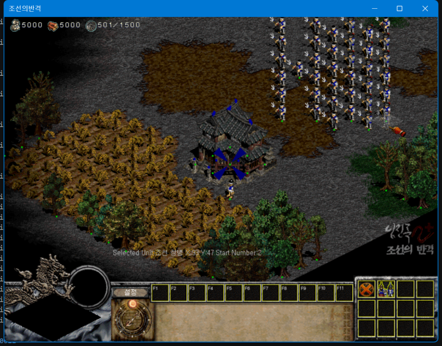
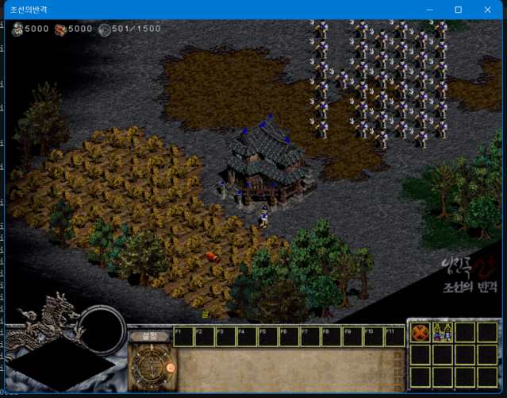
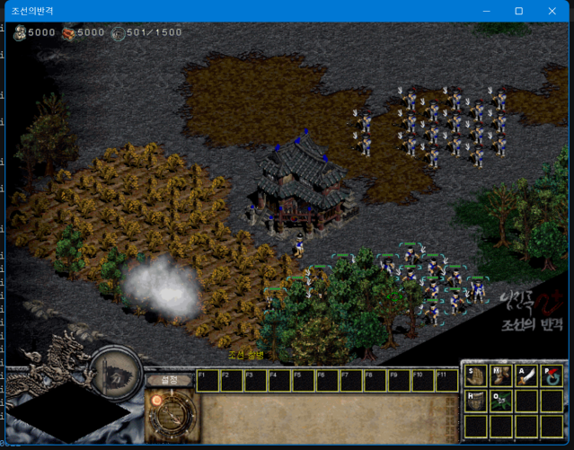

# 37창병 세이브 기반 전장 성능 검증

메뉴·로비 및 농부 한 개만 있는 전장 검증을 보완하기 위해, 일반 ESL 클라이언트에서 조선 창병 37개와 농부 1개가 존재하는 세이브를 만들었다. 병력 집단의 이동을 확인한 뒤 출력 간격과 커서 입력 전달을 측정한다.

## 재현 상태

- 실행 파일: `[ESL]Syw2plus 2606.exe`, 일반 게임 실행 파일. 맵 에디터 실행은 측정에서 제외한다.
- 래퍼: `98d0114`, GPU / Sharp Bilinear / VSync OFF, 창 모드.
- 실제 입력 크기: 800×600. 창과 DPI 등 측정 환경은 각 실행의 `result.json`에 기록한다.
- 아군: 조선 창병 37개, 농부 1개, 본영 1개. 건물은 30유닛 조건에 포함하지 않는다.
- 세이브: `output/battle-37-fixture/save002.dat` (게임의 세 번째 슬롯).
- 세이브 SHA-256: `f876cabedb9eecec1549b81a85b7e94ce9915f08800503bdaa7eb59b3739e6ce`.
- 편집 맵: `output/battle-37-fixture/battle-37-spearmen.map`.

동봉된 맵 에디터에서 `Terrain → Unit → Korea → Character → 조선 창병`, `Player 1`, `In Game`을 사용했다. 최초 한 개와 6×6 배치 36개를 추가했다. 배치 전후 인구는 20 → 501이며, 창병 37개 × 13의 증가량과 일치한다. **인구 501을 유닛 501개로 해석하지 않는다.** 배치 좌표는 `unit-placement.json`에 남겼다.

일반 게임의 사용자 지도 목록에서 해당 맵을 시작하고 게임 자체 저장 기능으로 세이브를 생성했다. 별도 측정 복사본에서 이 세이브를 불러와 배치된 병력을 재확인했다. 최종 상태의 식량·목재는 각각 5,000이며 속도·생산 시간·무적 설정은 바꾸지 않았다. 초기 자원 보충 생산 실험의 세이브는 최종 측정에 사용하지 않는다.

## 실행 방법

1. 종료된 별도 테스트 설치의 `save` 폴더에 세이브를 복사한다. 기존 세 번째 슬롯이 있다면 먼저 보존한다.
2. `불러오기`에서 세 번째 슬롯을 선택한다.
3. 전장과 37창병 배치가 표시되는지 확인한다. 로딩·메뉴·저장 화면을 측정 구간에 포함하지 않는다.
4. 집단 이동 구간은 병력을 드래그 선택한 뒤 빈 지형 사이로 이동 명령을 반복한다. 게임의 선택 상한 때문에 한 번의 드래그가 37개 모두를 선택한다고 가정하지 않는다.
5. 커서 자동 이동 구간에는 마우스를 직접 움직이지 않는다. 포커스 이탈, 창 이동, 설정 변경, 계측 손실은 결과 유효성 검사에서 확인한다.

CSV 계측에서는 OSD를 꺼서 부가적인 그리기 비용을 제외한다. OSD 표시 검증과 CSV 측정을 구분한다. 결과의 호출률은 모니터 표시 FPS가 아니며 입력 전달 시간은 입력부터 화면 반응까지의 전체 지연이 아니다.

## 결과

### 유효한 30초 커서 측정

`output/perf-battle-37-cursor-20260911/run-00/result.json`: **valid=true**, 이벤트 손실 0, 포커스 이탈 없음, 설정·창 크기 변경 없음, GPU 출력 실패 0. 동일한 세이브의 시작 시점에 창병 37개를 확인했다. 병력은 대기 상태이며 자동 커서 이동을 수행했다. 매 프레임 생존 유닛 수를 계측한 것은 아니다.

| 지표 | 결과 |
| --- | --- |
| 측정 시간 | 30.0055초 |
| 출력 API 호출률 | 30.072회/초, 모니터 표시 FPS 아님 |
| 출력 호출 간격 p95 / p99 / 최대 | 51.0131 / 51.9672 / 55.0252ms |
| 래퍼 출력 처리 시간 p95 / 최대 | 0.3923 / 0.9511ms |
| GPU Present CPU 시간 p95 / 최대 | 0.1939 / 0.3978ms |
| 마우스 메시지 잠금 대기 최대 | 0.0007ms |
| 합성 입력 전달 상한 p95 / p99 / 최대 | 4.3773 / 6.9029 / 8.3811ms |
| 입력 주입 / 매칭 | 1,734 / 1,720회 |
| 게임 프로세스 CPU | 논리 코어 하나 기준 98.21% |

14개 입력은 관찰된 메시지와 매칭되지 않았다. 메시지 병합 등이 가능하므로 하드웨어 입력 유실률로 해석하지 않는다. 전달 시간은 `SendInput` 호출부터 래퍼의 메시지 진입까지이며, 게임의 입력 사용·커서 그리기·화면 표시까지 포함하지 않는다.

`cursor_query`는 601회, 초당 20.030회였다. 조회 간격 중앙값은 50.0073ms, p99는 51.0774ms다. 입력 메시지가 비교적 빨리 도착해도 게임이 입력을 조회하고 화면에 반영하는 주기가 다를 수 있음을 보여준다. **이 수치만으로 실제 커서 지연이 50ms라고 단정하거나 원인을 확정하지 않는다.**

가장 긴 출력 호출 간격 55.0252ms 중 직전 GPU Present의 CPU 시간은 0.1062ms였으며, 나머지 54.9190ms는 그 Present 밖에 있었다. 이 표본에서는 긴 간격을 GPU Present 대기로 설명할 근거가 없다. 원본 클라이언트 대비 속도, 실제 표시 FPS, 입력부터 화면 반응까지의 전체 지연은 추가 측정이 필요하다. 파생 계산은 `battle-analysis.json`에 남겼다.

### 집단 이동 관찰과 무효 실행

첫 시도 `output/perf-battle-37-move-20260911/run-00`는 무효다. 준비 중 계측 버퍼가 가득 차 42,856개 이벤트를 버렸고, 측정 구간의 출력 이벤트가 남지 않았으며 포커스 이탈도 발생했다. 이 실행의 FPS·지연 수치를 비교 표에 넣지 않는다.

병력 집단의 이동 자체는 위 스크린샷으로 확인했다. 추가 시도 `output/perf-battle-37-move-valid-20260911`도 측정 전 포커스가 바뀌어 시작하지 않았다. 폴더 이름과 무관하게 유효한 이동 부하 성능 결과는 아니다. 위의 유효 수치는 **대기 병력 37개가 존재하는 전장 + 커서 이동** 조건에만 해당하며, 집단 이동·교전 내내 30개 이상이 활동한 결과로 확대하지 않는다.

### 재사용 파일

`output/battle-37-fixture/manifest.json`에는 게임·에디터·DLL·맵·세이브의 해시가 있다. `output/battle-37-fixture.zip`은 로컬 재현용 세이브와 맵, 사용법, 검증 결과를 묶은 파일이다. 게임 EXE와 데이터 파일은 포함하지 않는다. 해당 파일들은 저장소에 커밋하거나 공개 배포하지 않았다.
