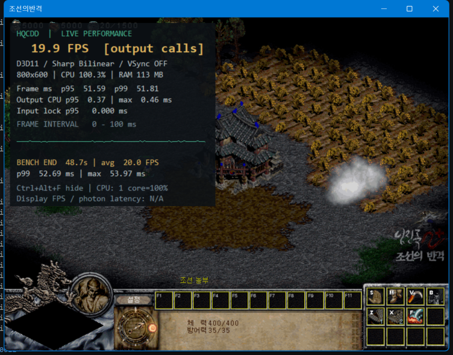

# 실시간 성능 오버레이

게임 화면 왼쪽 위에 반투명 성능 패널을 표시합니다. 별도 프로그램이나 관리자 권한은 필요하지 않습니다. GPU와 GDI, 창 모드와 테두리 없는 전체화면에서 사용할 수 있습니다.



*Windows 11의 ESL 클라이언트에서 확인한 화면입니다. 메뉴 진입, 유닛 선택과 패널 아래로의 이동 명령, 측정 시작·종료, 표시·숨김 및 설정 창 전환을 확인했습니다. 대규모 전투 부하 테스트 결과는 아닙니다.*

- **Ctrl+Alt+F**: 표시/숨김.
- **Ctrl+Alt+B**: 벤치마크 시작/종료. 패널이 꺼져 있으면 함께 켭니다. 다시 시작하면 이전 결과를 지웁니다.
- 게임 창의 시스템 메뉴에도 같은 항목이 있습니다.
- 기본은 꺼짐입니다. 실행할 때부터 표시하려면 `hqcdd.ini`에 다음을 설정합니다.

```ini
[Diagnostics]
OSD=1
```

패널은 마우스 클릭과 키보드 포커스를 받지 않습니다. 디스플레이 설정 또는 저장·불러오기 같은 별도 대화상자를 열거나 게임이 비활성화·최소화되면 숨겨지고 진행 중인 벤치마크가 종료됩니다. 다시 게임으로 돌아오면 패널과 마지막 결과가 표시됩니다. 설정을 적용하거나 Alt+Enter로 화면 모드를 전환하면 측정 조건이 바뀌므로 이전 결과를 지웁니다.

## 표시되는 값

| 항목 | 의미 |
| --- | --- |
| FPS [output calls] | 성공한 래퍼 출력 호출의 초당 횟수. 최근 최대 240개, 5초 이내의 표본을 사용하며 1초 동안 출력이 없으면 0을 표시합니다. |
| Frame ms / 그래프 | 출력 완료 사이의 간격 p95·p99와 추이. 그래프 세로축은 0–100ms이며 범위를 넘는 값은 상단에 잘립니다. 수치 통계에는 원래 값을 사용합니다. |
| Output CPU | 출력 함수에서 보낸 경과 시간의 p95·최댓값. 이미지 변환, 업로드 및 Present 대기를 포함하며 GPU 실행 시간은 아닙니다. |
| Input lock | 마우스 메시지를 처리할 때 래퍼 잠금을 기다린 시간 p95. 최근 최대 240회, 마지막 입력 후 5초가 지나면 N/A. |
| CPU / RAM | 게임 프로세스의 CPU 사용량과 작업 집합 메모리. 논리 코어 하나를 모두 사용하면 100%이므로 100%를 넘을 수 있습니다. |
| BENCH REC / END | 측정 중/종료, 경과 시간과 평균 출력 호출률. 100개 이상의 간격이 모이면 p99와 최댓값을 표시합니다. |

**출력 호출률은 모니터에 실제 표시된 FPS나 게임 시뮬레이션 속도가 아닙니다.** 게임은 한 프레임에 여러 번 출력할 수 있습니다. Input lock 역시 전체 커서 지연을 뜻하지 않습니다. 실제 표시 FPS와 입력부터 화면 반응까지의 지연은 `N/A`로 명시합니다. 하드웨어 센서의 온도·전력·GPU 사용률은 이 기능에서 수집하지 않습니다.

## 전장 측정

유닛 수가 있는 상태를 반복 검증하려면 [37창병 세이브와 측정 결과](battle-37-benchmark.md)를 사용합니다. 인구 수치는 실제 유닛 개수와 다르므로 구분해야 합니다.

`임의 게임 → 혼자 하기 → 게임 시작`으로 전장에 진입한 뒤 Ctrl+Alt+B를 누릅니다. 유닛 이동, 화면 스크롤 등 확인하려는 동작을 수행하고 다시 눌러 결과를 고정합니다. 메뉴와 로비, 전장을 각각 별도 구간으로 측정하세요. 렉이 발생했을 때 패널이 포함된 스크린샷을 남기면 출력 간격과 출력 처리 시간을 함께 비교할 수 있습니다.

벤치마크는 메모리에만 저장되며 게임 종료 시 사라집니다. 최대 120,000개 간격에서 자동 종료하고 `*limit`를 표시합니다. CSV 및 입력 전달 시간 분석은 기존 [성능 테스트 도구](performance-testing.md)를 사용합니다.

패널은 초당 4회, 프로세스 사용량은 초당 1회 갱신합니다. 통계 계산과 그리기는 출력 데이터 잠금 밖에서 실행합니다. 오버레이 자체의 그리기와 Windows 합성에도 비용이 있으므로 정밀 비교에서는 OSD의 켜짐/꺼짐 조건을 통일하세요. 최대 240개 표본과 벤치마크 간격 120,000개로 메모리 사용량을 제한합니다.
## OSD 표시 중 FPS 0과 클릭 중단 조사

2026-09-11 ESL 실행에서 Windows 전경 창은 게임인데 게임 내부 활성 상태는 비활성으로
남아 있는 상황을 관측했다. 활성화 알림을 다시 전달하자 게임의 중단 플래그가 해제됐다.
OSD의 0 FPS는 최근 출력 호출이 없다는 뜻이며, 그 자체가 클릭을 막는 설정은 아니다.

OSD 창에 `WS_DISABLED`를 추가하고, 게임의 `WM_ACTIVATEAPP` 처리를 OSD 표시 변경보다
먼저 실행한다. 활성 알림 시점의 전경 창이 아직 게임이 아니거나 같은 스레드의 팝업에서
복귀하는 경우, 큐에 넣은 메시지에서 전경 상태를 재확인해 필요한 활성 알림만 보완한다.
게임이 숨김·최소화·비활성 창이거나 모달/설정 화면으로 잠겼으면 복귀를 강제하지 않는다.
주기적으로 활성 알림을 보내거나 EXE 내부 상태를 직접 수정하지 않는다.

ESL의 활성 판단과 클릭 게이트를 모사한 네이티브 회귀 테스트는 수정 전 DLL/ASI 모두 실패,
수정 후 모두 통과했다. 실제 ESL 수정 빌드의 재시작 검증은 별도로 필요하다.

활성화 콜백과 후속 처리 동안에는 임시 COM 참조로 Draw 수명을 보장한다.
콜백에서 게임 창을 파괴했다면 후속 창·OSD 처리를 건너뛴다. 일반/지연 콜백 각각에 대해
마지막 외부 참조 해제와 창 파괴 유무 네 가지 조합을 DLL·ASI 회귀 테스트로 검증했다.
